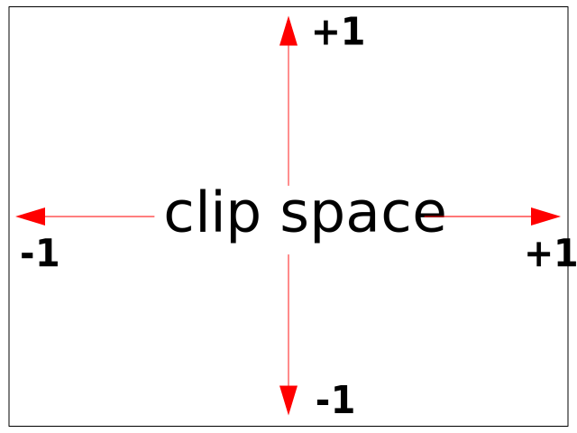
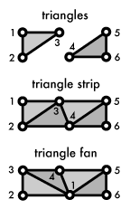

# Start hacking WebGL

## Concepts

### Rendering in 3D Graphics
> According to Allen Tucker(Do not really know who this man is), rendering is the name given to the process in 3-dimensional graphics whereby the geometric description of an object is converted into a 2-dimensional image-plane representation that looks real.

### 2D/3D Graphics & Visual effects
visual effects, such as lighting, texturing, shadows

### WebGL
> In reality WebGL is just a rasterization engine.

WebGL uses GLSL to communicate with the graphics hardware(GPU).

With WebGL, 2D and 3D graphics, image processing, procedural texturing, terrain generation, visual effects such as reflections, refraction, smoke, fire, and fluids, or even non-graphic general computing that takes advantage of powerful GPU features, are all possible.

WebGL programs consist of control code written in JavaScript and special effects code (shader program) that is executed on a computer's Graphics Processing Unit (GPU).

#### [rendering context](https://developer.mozilla.org/en-US/docs/Web/API/WebGLRenderingContext)

- [Detect WebGL context](https://developer.mozilla.org/en-US/docs/Learn/WebGL/By_example/Detect_WebGL)
    WebGL in browsers leverages the WebGL context from a cavas element. The following code shows how to get a WebGL context:
    ```javascript
    let canvas = document.createElement("canvas");
    // Get WebGLRenderingContext from canvas element.
    let gl = canvas.getContext("webgl")
      || canvas.getContext("experimental-webgl");
    if (gl && gl instanceof WebGLRenderingContext) {
      // webgl context got
    } else {
      // failed to get, the current browser does not support webgl
    }
    ```
    There are a great many properties and methods in the WebGL contexts, which can be used to view the *states*, set/change *buffers*, *FrameBuffers*, *RenderBuffers*, *Drawing buffers*, and set *textures* or deal with *shader programs*, as well as *uniforms* and *attributes*.

    > The WebGL rendering context is an interface, through which you can set and query the state of the graphics machine, send data to the WebGL, and execute draw commands.

##### Operations on rendering context
Take the drawing buffer clearing as an example(it does not matter not knowing what draw buffer is), clearing the drawing buffer with a solid color might be the simplest graphical operation on a WebGL context. This operation consists of 2 stages: firstly, set the internal state of the rendering context, then call the draw method. From this simple operation, we can feel something about how the state of a context work(the machanism).

```javascript
let gl = canvas.getContext("webgl")
        ||canvas.getContext("experimental-webgl");

// Set the WebGLRenderingContext clear color to the(param: r, g, b, a)
gl.clearColor(color[0], color[1], color[2], 1.0);

// Clear the context with the newly set color.
gl.clear(gl.COLOR_BUFFER_BIT);
```

Only a handful of method in the context do actual drawing, other methods are used to set/query the WebGL states.

    > This is why WebGL/OpenGL is often called a state machine.

And the input of this state machine is **the data and the commands**, and output should be the pixels(?) into the frame buffer(?).

For example, the color masking in WebGL.

    > WebGL is not only a state machine, it is also a graphics **pipeline**. This means that graphics operations in WebGL are done in a certain order, where the output of each operation serves as the input of the next. 

The word **pipeline** here is really important. As the quote says, the operations are done in a certain order everytime(or every frame in the animation) when we are trying to render the data into pixels on the screen finally. The state could also be changed in each frame.

Another example operation method we need to talk about here is [`scissoring`](https://developer.mozilla.org/en-US/docs/Learn/WebGL/By_example/Basic_scissoring). The `scissor()` method defines a mask that only allows `pixels` inside the specified rectangular area to be updated.

    > A pixel is a picture element (in practice, a point) on the screen, or a single element of the drawing buffer, that area in memory that holds your pixel data (such as RGBA color components). A fragment refers to the pixel while it is being handled by the WebGL pipeline.

So simply speaking, the fragment is the pixel being processed in the WebGL pipeline. The final state of fragment is the pixel in the drawing buffer.

Scissoring is a distinct stage in the WebGL/OpenGL graphics pipeline (it occurs after color clearing, but before color masking in the WebGL **pipeline**). Before the actual pixels are updated, fragments must go through the scissor test. If the fragments pass the scissor test, they **continue down the graphics pipeline**, and the corresponding pixels are updated on the screen. If they fail the test, they are immediately discarded, no further processing occurs, and pixels are not updated. The
detais on **graphics pipeline** will be discussed below.

This also means not every pixel in the `canvas` will be updated in every frame in animations.

And since the canvas hold everything that WebGL produces, so how does the canvas size affect rendering?

When setting the canvas to a specific size, we set `cavas.width` to the clientWidth of canvas. Note that the property `width` of canvas is not a style property. Make sure to set the canvas size clear to maintain a stable drawing..

##### Attributes/properties in rendering context
- states
    states here includes the active texture unit, etc.
    - color masking

- Shader programming: [GLSL(GLslang)](https://www.khronos.org/opengl/wiki/Core_Language_(GLSL))
    A Shader program will be executed on a computer's Graphics Processing Unit (GPU).
    The Shader program is writen in GLSL language. The GLSL is a C-like language.
    Normally, there are 2 Shader programs needed: *vertex shader*, and *fragment shader*
    ```javascript
    // firstly create a corresponding shader
    let vertexShader = gl.createShader(gl.VERTEX_SHADER);
    // then load shader source code, source is the GLSL code
    gl.shaderSource(vertexShader, source);
    // then, compile shader
    gl.compileShader(vertexShader);
    // 
    let program = gl.createProgram();
    // attach
    gl.attachShader(program, vertexShader);
    // link
    gl.linkProgram(program);
    ```
    See [a simple example](https://jsfiddle.net/06yz3ngc/1/) on MDN for more details and hands-on test.
    - vertex shader
    - fragment shader

- textures
    A texture in computer graphic is . We should do calculations for every pixel in the fragment shader.
    The textures could be pure colors, or binary image files, or even video files.

- geometry

- user interaction
    The canvas that has the WebGL context in it can interact with users' actions. One way is to directly add event handlers onto the `canvas` element. Another way, if we need to respond to the events on some specific pixels(some graphic instances), we need to translate the coordinates of where the clicking event exactly took place. Because we cannot know which graphic instance is being clicked. We should transform the position of the click event from
  // window coordinates to relative position inside the canvas. Then compare the event position with the position of the graphic instance. See the example ["Catch raining rectangles"](https://developer.mozilla.org/en-US/docs/Learn/WebGL/By_example/Raining_rectangles) on MDN for details.

#### How much we should know about GLSL
Here is a good introduction on GLSL in detail: [GLSL: An Introduction](http://nehe.gamedev.net/article/glsl_an_introduction/25007/). It is recommended to read it first.

#### Buffers in WebGL
> Buffers are arrays of binary data you upload to the GPU.

Usually buffers contain things like positions, normals(法向量), texture coordinates, vertex colors, etc although you're free to put anything you want in them.

#### Attributes
> Attributes are used to specify how to pull data out of your buffers and provide them to your vertex shader.

#### Uniforms
> Uniforms are effectively global variables you set before you execute your shader program.

#### Textures
> Textures are arrays of data you can randomly access in your shader program. 

The most common thing to put in a texture is image data but textures are just data and can just as easily contain something other than colors.

#### Varyings
> Varyings are a way for a vertex shader to pass data to a fragment shader. 

Depending on what is being rendered, points, lines, or triangles, the values set on a varying by a vertex shader will be interpolated while executing the fragment shader.

- Drawing Buffer

### [Related to OpenGL](http://duriansoftware.com/joe/An-intro-to-modern-OpenGL.-Table-of-Contents.html)

It is well known that the WebGL [is](https://www.khronos.org/webgl/):
> a cross-platform, royalty-free web standard for a low-level 3D graphics API based on OpenGL ES, exposed to ECMAScript via the HTML5 Canvas element.

So we are gonna talk about something on OpenGL, which would help us better understand the logic in WebGL.

> In its modern form, OpenGL is a cross-platform library for interfacing with programmable GPUs for the purpose of rendering real-time 3d graphics.

> OpenGL became a standard alongside Microsoft's proprietary Direct3d library for controlling graphics accelerators in consumer PCs.

> In recent years, the [Khronos group](http://www.khronos.org/) has taken stewardship of the OpenGL standard, updating it to support the features of modern programmable GPUs, pushing it into the mobile and online domains with OpenGL ES and WebGL, and streamlining it in OpenGL 3 by deprecating the outdated features that cluttered earlier versions of the library.

The GPUs always have rich computational resources. So in recent years, GPUs has been widely used in the fields of machine learning, data minning, ect. So there is a new standard **GPGPU** used to provide access to a GPU's computation units, ignoring its graphics-specific hardware.

> MacOS X's OpenGL implementation always supports OpenGL 2.0. On Windows, you're dependent on your graphics card drivers to provide OpenGL 2 or later.

For those machines that does not supported OpenGL 2.0, there is a way of fallback.
> For a fallback, Mesa provides an open-source, cross-platform software OpenGL 2.1 implementation that works on Windows and almost all Unix platforms.

> Mesa is also the most common OpenGL implementation on Linux, where it also works with the X server to interface OpenGL with graphics hardware using "direct rendering interface" (DRI) drivers.

#### Graphic Pipeline
The graph below roughly shows the graphics pipeline.


(from http://duriansoftware.com/joe/An-intro-to-modern-OpenGL.-Chapter-1:-The-Graphics-Pipeline.htm )

~~The input of WebGL(i.e. the state machine) has been mentioned before.~~

The **triangles** in the pipeline are vital elements in the pipeline where they act as the **medium**.

> The graphics pipeline that OpenGL implements reflects this:
> the host program fills OpenGL-managed memory buffers with arrays of vertices;
> these vertices are projected into screen space, assembled into triangles, and rasterized into pixel-sized fragments;
> finally, the fragments are assigned color values and drawn to the framebuffer.

> Modern GPUs get their flexibility by delegating the "project into screen space" and "assign color values" stages to uploadable programs called **shaders**. 

- The vertex and element arrays
    > A rendering job starts its journey through the pipeline in a set of one or more **vertex buffers**, which are filled with arrays of **vertex attributes**.

    The **vertex attributes** is the input to the **vertex shader**.
    > Common vertex attributes include **the location of the vertex in 3d space**, and **one or more sets of texture coordinates** that *map the vertex to a sample point on one or more textures*.
    > When a render job is submitted, we supply an additional element array, **an array of indexes into the vertex array that select which vertices get fed into the pipeline**. The order of the indexes also controls how the vertices get assembled into triangles later on.

- Uniform state and textures
    As mentioned before, the WebGL is also a state machine. The states provide a set of shared, read-only values to the shaders at each programmable stage of the pipeline. For instance, the *clear color* mentioned elier in WebGL.
    > This allows the shader program to take parameters that don't change between vertices or fragments.

    Textures are commonly used to map texture images onto surfaces. They can also be used as lookup tables for precalculated functions or as datasets for various kinds of effects.

- [The vertex shader](https://developer.mozilla.org/en-US/docs/Web/API/WebGL_API/Tutorial/Adding_2D_content_to_a_WebGL_context#Vertex_shader)
    > The GPU begins by reading each selected vertex out of the vertex array and running it through the vertex shader, a program that takes a set of vertex attributes as inputs and outputs a new set of attributes, referred to as [varying values](https://developer.mozilla.org/en-US/docs/Web/API/WebGL_API/Data#Varyings), that get fed to the rasterizer.

     The **vertex shader calculates the projected position of the vertex in screen space**.

     Or let's say, the job of the vertex shaders is:

     > Its job is to transform the input vertex **from its original coordinate system** into **the clipspace coordinate system** used by WebGL, in which **each axis has a range from -1.0 to 1.0**, regardless of aspect ratio, actual size, or any other factors.

     `[clipspace](https://www.opengl.org/discussion_boards/showthread.php/133926-What-exactly-does-clip-space-mean)` 

     Clipspace coordinates always go from -1 to +1 no matter what size your canvas is.

     

     > The vertex shader must perform the needed transforms on the vertex's position, make any other adjustments or calculations it needs to make on a per-vertex basis, then **return the transformed vertex by saving it in a special variable provided by GLSL, called `gl_Position`**.

     > The vertex shader can also generate other [varying](https://developer.mozilla.org/en-US/docs/Web/API/WebGL_API/Data#Varyings) outputs, such as a color or texture coordinates, for the rasterizer to blend across the surface of the triangles connecting the vertex.

     > Our vertex shader below receives vertex position values from an attribute we define called aVertexPosition. That position is then multiplied by two 4x4 matrices we provide called uProjectionMatrix and uModelViewMatrix; `gl_Position` is set to the result.

     ```javascript
	 // Vertex shader program
  	 const vsSource = `
        // // an attribute will receive data from a buffer
     	attribute vec4 aVertexPosition;

		uniform mat4 uModelViewMatrix;
		uniform mat4 uProjectionMatrix;

        // all shaders have a main function
		void main() {
            // vertex shader will set this variable as the result produced by itself.
            gl_Position = uProjectionMatrix * uModelViewMatrix * aVertexPosition;
		}
	  `;
     ```

     And some other stuff like handling lighting, textures, etc., which will be talked about later.

- Triangle assembly
    This step in the pipeline is to take the vertices in the order specified by the **element array** and grouping them to connect the projected vertices to form triangles.

    

    The vertices can be grouped in a few different ways shown above.

- Rasterization
    The triangles from former steps are the input of rasterizer.
    > The rasterizer takes each triangle, clips it and discards parts that are outside of the screen, and breaks the remaining visible parts into pixel-sized fragments.

    

    > As mentioned above, the vertex shader's [varying](https://developer.mozilla.org/en-US/docs/Web/API/WebGL_API/Data#Varyings) outputs are also interpolated across the rasterized surface of each triangle, **assigning a smooth gradient of values to each fragment.** For example, if the vertex shader assigns a color value to each vertex, the rasterizer will blend those colors across the pixelated surface as shown in the diagram.

- The fragment shader
    The fragments generated by `Rasterization` then pass through another program called the fragment shader.

	> The fragment shader is called once for every pixel on each shape to be drawn, after the shape's vertices have been processed by the vertex shader. Its job is to determine **the color of that pixel** by figuring out which [texel](https://en.wikipedia.org/wiki/Texel_(graphics)) (that is, **the pixel from within the shape's texture**) to apply to the pixel, getting that texel's color, then applying the appropriate **lighting to the color**.

	The color of the pixel will then be stored in the variable `gl_FragColor`.

    > It outputs color and depth values that then get drawn into the framebuffer. Common fragment shader operations include texture mapping and lighting.

    > Since the fragment shader runs **independently** for every pixel drawn, it **can perform the most sophisticated special effects**; however, it is also the most **performance-sensitive part** of the graphics pipeline.

    ```javascript
    // an example of fragment shader
	const fsSource = `
        // fragment shaders don't have a default precision so we need
        // to pick one. mediump is a good default. It means "medium precision"
        precision mediump float;

        // all shaders have a main function
		void main() {
            // gl_FragColor is a special variable a fragment shader
            // is responsible for setting
            // r, g, b, a
			gl_FragColor = vec4(1.0, 1.0, 1.0, 1.0);
		}
	`;
    ```

- Shader program
   Together, a set of vertex and fragment shaders is called a shader program.

   **WebGL only cares about 2 things: clipspace coordinates and colors. A Vertex shader which provides the clipspace coordinates and a fragment shader that provides the color.**
 
    A shader program processes the original input data(vertices info) and produce the **output for the screen(the positions of the pixels and their colors)**:
    > **A shader program take information about the vertices that make up a shape and generates the data needed to render the pixels onto the screen: namely, the positions of the pixels and their colors.**

	The code below shows how to create a shader:
	```javascript
	//
	// creates a shader of the given type, uploads the source and
	// compiles it.
	//
	function loadShader(gl, type, source) {
		const shader = gl.createShader(type);

		// Send the source to the shader object

		gl.shaderSource(shader, source);

		// Compile the shader program

		gl.compileShader(shader);

		// See if it compiled successfully

		if (!gl.getShaderParameter(shader, gl.COMPILE_STATUS)) {
			alert('An error occurred compiling the shaders: ' + gl.getShaderInfoLog(shader));
			gl.deleteShader(shader);
			return null;
		}

		return shader;
	}

	//
	// Initialize a shader program, so WebGL knows how to draw our data
	//
	function initShaderProgram(gl, vsSource, fsSource) {
		const vertexShader = loadShader(gl, gl.VERTEX_SHADER, vsSource);
		const fragmentShader = loadShader(gl, gl.FRAGMENT_SHADER, fsSource);

		// Create the shader program

		const shaderProgram = gl.createProgram();
		gl.attachShader(shaderProgram, vertexShader);
		gl.attachShader(shaderProgram, fragmentShader);
		gl.linkProgram(shaderProgram);

		// If creating the shader program failed, alert

		if (!gl.getProgramParameter(shaderProgram, gl.LINK_STATUS)) {
			alert('Unable to initialize the shader program: ' + gl.getProgramInfoLog(shaderProgram));
			return null;
		}

		return shaderProgram;
	}
	```

- Framebuffers, testing, and blending
    > A framebuffer is the final destination for the rendering job's output, which the content of pixels will be displayed on the screen.
    In addition to the default framebuffer OpenGL gives you to draw to the screen, most modern OpenGL implementations let you make framebuffer objects that draw into offscreen renderbuffers or into textures. Those textures can then be used as inputs to other rendering jobs. A framebuffer is more than a single 2d image; in addition to one or more color buffers, a framebuffer can have a depth buffer and/or stencil buffer, both of which optionally filter fragments before they are drawn to the framebuffer: Depth testing discards fragments from objects that are behind the ones already drawn, and stencil testing uses shapes drawn into the stencil buffer to constrain the drawable part of the framebuffer, "stencilling" the rendering job. Fragments that survive these two gauntlets have their color value alpha blended with the color value they're overwriting, and the final color, depth, and stencil values are drawn into the corresponding buffers.


After all these operations in a pipeline, a single "draw" call in OpenGL is done.
> Rendering a scene usually involves multiple draw jobs, switching out textures, other uniform state, or shaders between passes and using the framebuffer's depth and stencil buffers to combine the results of each pass.


### Animation
When animating, the states of the WebGL state machine may not be changing all the time, sometimes, it is initialized at first and then constantly drawing/rendering in every frame using `timer`/`requestAnimationFrame`

#### Colors
- [Color masking](https://developer.mozilla.org/en-US/docs/Learn/WebGL/By_example/Color_masking)
    Color masking in WebGL demonstrates the basics of color theory. So, by masking off the blue and green channels, you are only allowing the red component of pixels to be updated, and therefore it is as if you were looking through a red tinted glass. Color masking gives you fine control of updating pixel values on the screen.

### Camera


### Scene

### Animation with WebGL

## Mathematics involved in 3D graphics
